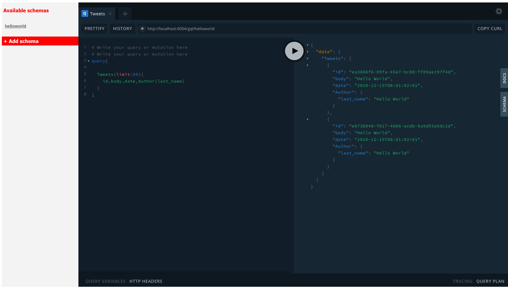
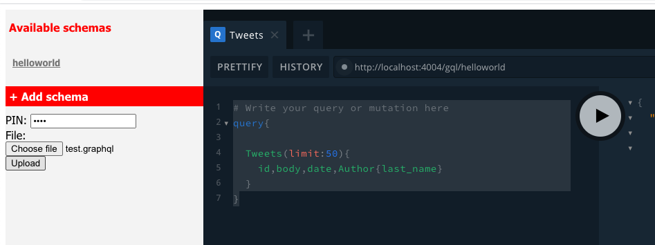
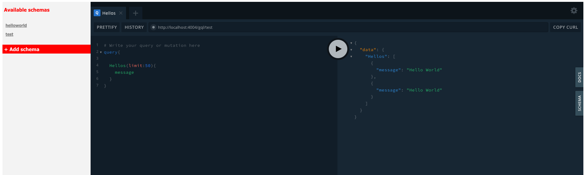

# VisualQL
VisualQL is GraphQL mockup server and multiple schema browsing web application.

## Hello world
We took some sample schema from Apollo, after successfull deployment of the VisualQL you should see `helloworld` in the list of available schemas and playground.



You can try following quey:
``` 
query
{
  Tweets(limit:50)
  {
    id,body,date,Author{last_name}
  }
}
```

## Adding new schema
Using `Add schema` one can add custom graphql schema.
The file uploaded must have `graphql` extension, otherwise gets ignored.



One have to provide configured PIN in order to authenticate upload (yeah, stupid, but works. Anyone can add OAuth2 or whatever auth).

Upload results in another schema shown, as you one see:


## Environment variables

|Variable|Description|Default|
|-|-|-|
|PIN|PIN to protect uploads|`327+723-`|
|PORT|HTTP port where the server is running|`4004`|
|SPEC_DIR|Directory where schemas in GQL format are stored|`./spec/`|
 
## Debugging
Use VisualStudio Code to open the folder **src**.
`.vscode` contais valid `launch.json`, use `DEBUG MOCK` configuration

## Development
- authentication is really stupid
- some error handling implemnted, but not really extensive
- logging to console
- no SSL at all

Feel free to improve via PRs.

## Deployment

### Local docker

- install local repository module
- issue couple of commands mentioned downbelow
```
cd src
docker build ./Dockerfile localhost:5000/visualql:latest 
docker run -e local.env -p 4004:4004 --name visualql localhost:5000/visualql:latest
```

and cleanup...
```
docker stop visualql  
docker rm visualql
```

Of course, you can turn it into compose file, Help chart, Kuberenets deployment etc. Imagination has no limits.

